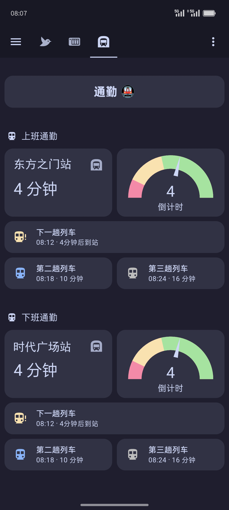
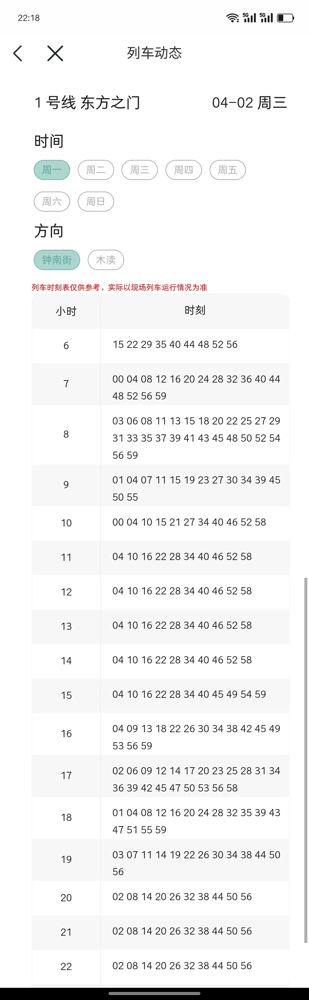

# Subway Timing 插件

国内很多城市提供了地铁时刻表，但没有提供实时到站信息接口。这个插件可以帮助你根据静态时刻表自动计算到站信息。

本插件通过读取配置文件中的时刻表信息，自动计算出当前最近的三趟列车到站时间，以及需要等待的时间。

## 特性

- 支持不同站点和方向的时刻表
- 区分工作日和周末时刻表
- 动态调整更新频率，接近到站时更新更频繁
- 支持通过配置流或YAML配置
- 提供友好的状态属性，便于在仪表板上显示

## 自定义仪表盘示例

一个仪表盘示例



你可以参考这个仪表盘的设计，具体代码在 `./examples` 目录下。

## 安装方法

1. 将 `custom_components/subway_timing` 文件夹复制到您的 Home Assistant 配置目录下
2. 将示例配置文件 `custom_components/subway_timing/config/info-sample.conf` 复制到同一目录，并重命名为 `info.conf`
3. 根据您所在城市的地铁时刻表修改 `info.conf` 文件
4. 重启 Home Assistant

## 配置方法

### 方法一：通过 Home Assistant 界面配置（推荐）

1. 进入 Home Assistant 界面
2. 点击 "配置" 菜单
3. 点击 "设备与服务"
4. 点击右下角 "添加集成" 按钮
5. 搜索并选择 "Subway Timing"
6. 按照向导完成配置：
   - 输入配置文件路径（默认为 `custom_components/subway_timing/config/info.conf`）
   - 选择站点
   - 选择方向
7. 完成后，您可以在仪表板中添加和使用该传感器

### 方法二：通过 configuration.yaml 配置

在 `configuration.yaml` 中添加以下配置：

```yaml
sensor:
  - platform: subway_timing
    name: 地铁到站时间
    config_path: custom_components/subway_timing/config/info.conf
    # 可选：指定特定站点和方向
    # station: 东方之门站
    # direction: 钟南街方向
```

## 配置文件格式

配置文件 (info.conf) 使用以下格式：

```
站点名称
方向名称
周一 周二 周三 周四 周五
小时 | 时刻
5 54
6 05 13 20 27 34 41 48 55
...

站点名称
方向名称
周六 周日
小时 | 时刻
5 54
6 07 14 21 28 35 41 49 56
...
```

## 传感器信息

插件会为每个站点和方向创建一个传感器实体，提供以下信息：

- **状态**: 下一班列车到达前的等待时间（分钟）
- **属性**:
  - `station`: 站点名称
  - `direction`: 方向名称
  - `friendly_wait_time`: 友好的等待时间描述（例如："5分钟后到站"）
  - `next_trains`: 接下来三趟列车的信息列表
  - `next_train_1_time`, `next_train_2_time`, `next_train_3_time`: 接下来三趟列车的具体到站时间
  - `next_train_1_wait`, `next_train_2_wait`, `next_train_3_wait`: 接下来三趟列车的等待时间
  - `last_updated`: 上次更新时间


## 自定义时刻表

您可以根据自己城市的地铁时刻表修改配置文件，添加更多站点和方向。时刻表通常可以从当地地铁官方网站或APP中获取。

如果您的城市地铁没有提供具体的时刻表，那么您不需要获取所有站点的所有时间。只需要维护有限的几个时间点即可。

比如您关注上下班时间，可以根据观察特定站点、特定时间点的到站时间、通过大致间隔推算等方式，仅维护早高峰和晚高峰的时间点。这样可以大大减少配置文件的复杂度。

例如仅维护 8、9、17、18、20 点的时间点，省略其他时间段——

```
8 50 56
9 02 08 15 22 30 37 44 52
17 00 06 12 18 24 30 36 42 48 54
18 00 06 12 18 24 30 36 42 48 54
20 00 06 12 18 24 30 36 42 48 54
```

这样可以减少配置文件的行数和复杂度，同时兼备实用性。



如图，这是一个可以查询到的城市地铁时刻表。
